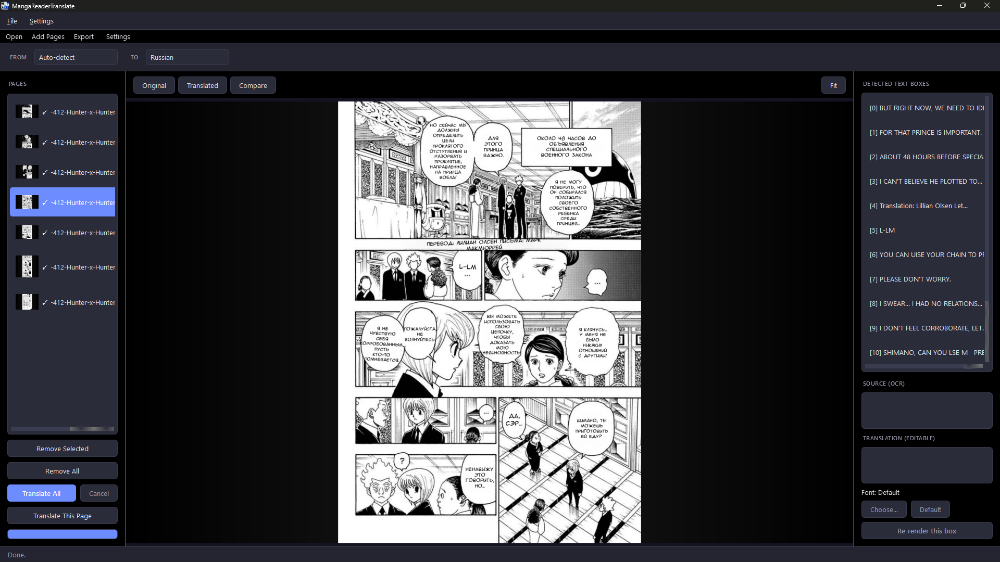

# MangaReaderTranslate

*[Читать на русском](RU_README.md)*

A free, fully local/offline manga translator for Windows. Point it at a manga
page (or a whole folder, or a `.cbz`), pick a source and target language, and
it detects the text in every speech bubble, translates it, erases the
original text, and draws the translation back in — all on your own machine,
no cloud APIs, no accounts, no per-page fees.



## What it actually does

1. **Finds the text** — a detector scans the page and finds every speech
   bubble, caption box, and sound effect.
2. **Reads it** — OCR turns each detected box into text, using a
   manga-specialized reader for Japanese and a general one for ~39 other
   source languages.
3. **Translates it** — a local translation model converts the text into your
   chosen target language (~40 languages, any pair).
4. **Erases the original** — an inpainting model removes the original text
   from the art while preserving line work and screentone underneath it, so
   there's no leftover smudge where the old text was.
5. **Draws the translation back in** — word-wrapped, auto-sized to fit the
   box, and rotated to match the original text's tilt.

Everything runs locally through `onnxruntime`/`ctranslate2`. It'll use your
GPU automatically if you have a compatible NVIDIA card, and falls back to CPU
without any extra configuration if not.

## Features

- **Open almost anything**: a single image, a whole folder, or a `.cbz`/`.zip`
  archive. Drag and drop works too.
- **Add pages incrementally**: already have pages loaded and want to add
  more — one file or a whole batch — without starting over? `Add Pages` (or
  drag another file/folder in) appends instead of replacing.
- **Long-strip auto-split**: some raw scan sites bundle a whole chapter into
  one giant vertically-stacked image instead of one file per page. The app
  detects that shape and automatically splits it back into individual pages
  on import.
- **Reorder and remove pages**: drag pages in the list to reorder them;
  multi-select (Ctrl/Shift-click) and remove selected pages, or clear
  everything, right from the sidebar.
- **Batch or single-page translation**: translate the whole loaded set in the
  background with a progress bar, or just the one page you're looking at.
- **Manual correction**: click any detected box (or pick it from the list) to
  see its OCR'd source text and its translation. Edit the translation and it
  re-renders automatically a moment after you stop typing — no need to
  re-run OCR/translation/inpainting just to fix one line.
- **Per-box, per-page, or app-wide custom fonts**: don't like the
  automatically-picked font for one bubble? Set a font just for that box.
  Want a specific font for one whole page, or for every page by default?
  Settings → Custom Font (app-wide), or right-click a page in the list → Set
  Font for This Page. The most specific setting always wins.
- **Zoom, pan, and a before/after compare slider**: scroll-wheel to zoom
  (centered under your cursor), drag to pan, and a draggable slider to wipe
  between the original and translated page side by side.
- **Page-turning your way**: hover over the page to reveal semi-transparent
  prev/next buttons (positioned for how you read — see Reading Mode below),
  or just use the arrow keys.
- **Session autosave**: close the app (even by accident) without exporting,
  and it offers to restore your translated pages and any manual edits next
  time you open it.
- **Export** the finished pages as plain images or repackage them straight
  into a new `.cbz`.

## System requirements

Not a lightweight app — budget disk space for the ML models plus either a
venv or the packaged exe.

|  | Minimum | Recommended |
|---|---|---|
| OS | Windows 10/11 (64-bit) | Windows 10/11 (64-bit) |
| Python (from source) | 3.11 | 3.11 |
| CPU | Any 64-bit, 4 cores | 4+ cores, last ~5-6 years |
| RAM | 8 GB | 16 GB |
| GPU | None — runs on CPU | NVIDIA, 4+ GB VRAM |
| Free disk space | ~9-10 GB | ~15 GB (SSD) |

Notes:

- **Disk breakdown**: the models (detector + inpainting + NLLB + manga-ocr +
  RapidOCR) come to roughly **3.5-4GB** total. On top of that you need either
  a Python venv (**~4.7GB**, running from source) or the packaged `.exe`
  folder (**~4.9GB**) — not both, pick one setup.
- **GPU is optional, NVIDIA-only**: AMD/Intel GPUs simply fall back to CPU
  automatically — still fully functional, just slower per page. See [GPU
  acceleration](#gpu-acceleration) below for what very new (Blackwell /
  RTX 50-series) cards need beyond a normal driver install.
- **SSD recommended**: models get loaded into memory on every launch, and
  that's noticeably slower off a spinning HDD.

## Quick start

Requires **Python 3.11** specifically (the ML dependencies below don't yet
support newer versions).

```
python -m venv .venv
.venv\Scripts\activate
pip install -r requirements.txt
python -m app.main
```

That's it — no separate setup step. Everything the app needs downloads
automatically the first time you translate a page, to
`%LOCALAPPDATA%\MRTranslateCache\models\`:

- The text detector and inpainting model (small, ~30–200MB each).
- manga-ocr and RapidOCR's own weights, per language, on first use.
- The translation model (~2.4GB) — downloaded with resume support (a dropped
  connection just picks back up rather than restarting), then converted to a
  faster local format (~1 minute, one-time). If you'd rather do this ahead of
  time instead of during your first translation, run
  `python scripts/convert_nllb_to_ct2.py`.

## Using the app

1. **Open something**: `File → Open Image / Open Folder / Open CBZ...`, or
   just drag a file onto the window. Loaded pages show up as thumbnails in
   the **Pages** panel on the left.
2. **Pick your languages**: the `From`/`To` dropdowns at the top. `From` has
   an `Auto-detect` option if you don't know (or don't want to specify) the
   source language.
3. **Translate**: `Translate All` runs every page in the background with a
   progress bar; `Translate This Page` only does the one you're currently
   viewing.
4. **Check the result**: the three buttons above the page — `Original`,
   `Translated`, `Compare` — switch between the untouched scan, the
   translated version, and a drag-to-reveal split view of both.
5. **Fix anything that looks wrong**: click directly on a bubble in the page
   (or pick it from `Detected Text Boxes` on the right) to select it. Its
   OCR'd source text and current translation show up below — edit the
   translation and it redraws automatically. Boxes with empty or low-
   confidence OCR are flagged with a ⚠ in the list, so you know what's worth
   double-checking.
6. **Add more pages whenever**: `File → Add Image(s) / Add Folder / Add
   CBZ...` appends to what's already loaded instead of replacing it. Drag
   pages in the list to reorder them; right-click or use the `Remove
   Selected`/`Remove All` buttons to drop pages you don't want.
7. **Export**: `File → Export as Images...` or `Export as CBZ...` once you're
   happy with the results.

### Keyboard shortcuts

| Key | Action |
|---|---|
| `Ctrl+O` | Open an image |
| `Ctrl+E` | Export as images |
| `Ctrl+0` | Reset zoom to fit the page |
| `←` / `→` | Previous / next page (from the page list or the viewer) |
| `↑` / `↓` | Previous / next page (while the viewer has focus) |
| `Space` | Toggle Original ↔ Translated |
| Mouse wheel (on page) | Zoom in/out, centered under the cursor |
| Left-drag (on page) | Pan around when zoomed in |

### Settings

`Settings → Preferences...`:

- **OCR Backend**: force RapidOCR for Japanese instead of the manga-specific
  `manga-ocr` reader, if you prefer.
- **Device**: Auto (try GPU, fall back to CPU) / CPU only / GPU only.
- **Reading Mode**: Horizontal or Vertical — only changes which edges the
  hover page-turn buttons sit on (left/right vs. top/bottom); the arrow keys
  work the same either way.
- **Custom Font**: an app-wide font used wherever a page or box doesn't have
  its own override.

## Packaging as a standalone `.exe`

```
pip install pyinstaller
pyinstaller pyinstaller.spec
```

Produces `dist/MangaReaderTranslate/MangaReaderTranslate.exe`, a self-
contained folder (a few GB, mostly ML runtime binaries) that runs without a
separate Python install on the target machine. Models still download to
`%LOCALAPPDATA%` on first use, same as running from source.

## GPU acceleration

Works out of the box on most NVIDIA GPUs, but on very new ones (Blackwell /
RTX 50-series) it needs more than `pip install onnxruntime-gpu`:

1. `requirements.txt` already pins `onnxruntime-gpu==1.27.0` and the
   `nvidia-*-cu12` pip packages (cublas/cudnn/cufft/curand/nvrtc) — these
   provide cuDNN 9 and are enough on their own for older GPUs.
2. **On a Blackwell GPU specifically**, `onnxruntime-gpu` needs CUDA **13.x**
   runtime libraries (`cublas64_13.dll` etc.) that aren't available as clean
   pip wheels yet. Install the official
   [CUDA 13.x Toolkit](https://developer.nvidia.com/cuda-downloads) for
   Windows (large, ~2.5GB, needs admin rights) — this also fixes
   `ctranslate2`'s GPU support, since it shares the same cuDNN dependency.
3. **Reboot after installing the Toolkit.** Its kernel-mode components don't
   always get picked up without one.
4. `app/core/gpu_bootstrap.py` handles the rest automatically at startup —
   registers both the pip `nvidia-*-cu12` package directories and the system
   CUDA Toolkit's `bin\x64` directory as DLL search paths.
5. Check `Settings → Preferences → Device` — if GPU init fails for any
   reason the app silently falls back to CPU rather than crashing.

## How it's built

| Stage | What's used | Why |
|---|---|---|
| Detection | [comic-text-detector](https://github.com/dmMaze/comic-text-detector) (ONNX) | Purpose-trained on manga/comic pages — finds bubbles and SFX, and estimates each region's rotation/style from the text mask shape. |
| OCR | [manga-ocr](https://github.com/kha-white/manga-ocr) (Japanese), [RapidOCR](https://github.com/RapidAI/RapidOCR) (everything else) | manga-ocr is fine-tuned specifically on manga dialogue; RapidOCR (PP-OCRv5, pure ONNX, no PaddlePaddle) covers the other ~39 source languages by script. |
| Translation | [NLLB-200-distilled-600M](https://huggingface.co/facebook/nllb-200-distilled-600M) via [CTranslate2](https://github.com/OpenNMT/CTranslate2) | One model covers all ~40 languages in both directions, quantized to int8 for fast local inference. |
| Inpainting | [ogkalu/lama-manga-onnx-dynamic](https://huggingface.co/ogkalu/lama-manga-onnx-dynamic) (LaMa) | Handles large-mask, texture-continuing inpainting far better than simple `cv2.inpaint`, which smears manga screentone. |
| Rendering | Pillow + free (OFL) fonts | Word-wrap + shrink-to-fit layout, rotated to match the original, styled per role (dialogue/emphasis/SFX/thought/mechanical). |
| UI | PySide6 (Qt, LGPL) | Desktop app: page viewer, batch panel, manual-correction panel, settings. |

## License

This project's own code is **MIT-licensed** (see [LICENSE](LICENSE)). It
depends at runtime on several third-party models with their own, different
licenses — see below, since one of them (NLLB) restricts the *whole running
app* to non-commercial use regardless of this project's own MIT license.

## Licensing notes

- **NLLB-200** checkpoints are released by Meta under **CC-BY-NC-4.0 —
  non-commercial use only**. This tool is free/personal-use, which is fine,
  but it cannot be sold or bundled into a commercial product without swapping
  the translation backend.
- `comic-text-detector` is **GPL-3.0**. This project only calls its published
  ONNX weights over `onnxruntime` (no GPL source code is vendored), but if you
  plan to redistribute this app, check GPL-3.0 compatibility for your use case.
- LaMa/`lama-manga-onnx-dynamic`, RapidOCR, and Noto Sans are **Apache-2.0** /
  **SIL OFL** — no restrictions beyond attribution.
- The bundled fonts (Comic Neue, Bangers, Caveat, Share Tech Mono, all **SIL
  OFL**) are deliberately *not* the commercial scanlation-standard fonts
  (Anime Ace, Blambot's Eepsion/DeadMetro, Comicraft's CC fonts, etc.) — those
  are paid fonts most scanlation groups use without a license. This project
  maps the same lettering *roles* (dialogue/emphasis/SFX/thought/mechanical)
  onto free equivalents instead.

## Known limitations

- Auto-detect source language is a Unicode-range heuristic over a RapidOCR
  first-pass read, not a real language-ID model — reliable for ja/ko/zh/ru/
  el/ar/hi/th, defaults to English otherwise. Always overridable in the UI.
- No RapidOCR recognition model wired up yet for Hebrew, Bengali, or Khmer.
- Region style/rotation detection is a shape heuristic on the text-pixel mask
  (solidity + angle), not a trained classifier — it can't reliably tell a
  thought bubble from a shout bubble, only "tilted → probably SFX" and
  "jagged strokes → probably emphasis".
- Long-strip auto-split looks for blank/uniform separator rows between
  concatenated pages; a truly seamless strip with no gap at all is left as
  one page rather than guessed at.

## Contributing

Issues and pull requests are welcome — this started as a personal project,
so there's no formal process, just open one.
